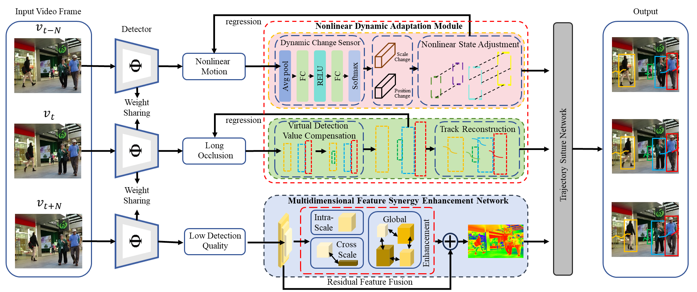

# DACE-MOT

**DACE-MOT** is a new MOT approach focused on dynamic adaptation and collaborative enhancement. It consists of a nonlinear adaptive kalman filter that makes adjust ments in object states for detecting anomalous motions. We also introduce a nonlinear motion adjustment mechanism that optimizes the prediction step that captures object dynamics. Furthermore, we develop a multi-dimensional feature enhancement network that elaborates on appearance-enhancing exploration accumulations across scales to reduce the input image’s quality effect. To tackle identity switches caused by occlusions, we create a trajectory stitching network that compares the spatiotemporal similarity of track fragments and merges them to maintain track continuity.

### Pipeline
<center>

</center>


## Installation
###  Installing on the host machine
```shell
git clone https://github.com/jya4134/DACE-MOT.git
cd DACE-MOT
pip3 install -r requirements.txt
python3 setup.py develop
```

## Data preparation

Download [MOT17](https://motchallenge.net/), [MOT20](https://motchallenge.net/), [CrowdHuman](https://www.crowdhuman.org/), [Cityperson](https://github.com/Zhongdao/Towards-Realtime-MOT/blob/master/DATASET_ZOO.md), [ETHZ](https://github.com/Zhongdao/Towards-Realtime-MOT/blob/master/DATASET_ZOO.md) and put them under <DACE-MOT_HOME>/datasets in the following structure:
```
datasets
   |——————mot
   |        └——————train
   |        └——————test
   └——————crowdhuman
   |         └——————Crowdhuman_train
   |         └——————Crowdhuman_val
   |         └——————annotation_train.odgt
   |         └——————annotation_val.odgt
   └——————MOT20
   |        └——————train
   |        └——————test
   └——————Cityscapes
   |        └——————images
   |        └——————labels_with_ids
   └——————ETHZ
            └——————eth01
            └——————...
            └——————eth07
```

Then, you need to turn the datasets to COCO format and mix different training data:

```shell
cd <DACE-MOT_HOME>
python3 tools/convert_mot17_to_coco.py
python3 tools/convert_mot20_to_coco.py
python3 tools/convert_crowdhuman_to_coco.py
python3 tools/convert_cityperson_to_coco.py
python3 tools/convert_ethz_to_coco.py
```

Before mixing different datasets, you need to follow the operations in [mix_xxx.py](https://github.com/ifzhang/ByteTrack/blob/c116dfc746f9ebe07d419caa8acba9b3acfa79a6/tools/mix_data_ablation.py#L6) to create a data folder and link. Finally, you can mix the training data:

```shell
cd <DACE-MOT_HOME>
python3 tools/mix_data_ablation.py
python3 tools/mix_data_test_mot17.py
python3 tools/mix_data_test_mot20.py
```

## Training

The COCO pretrained YOLOX model can be downloaded from their [model zoo](https://github.com/Megvii-BaseDetection/YOLOX/tree/0.1.0). After downloading the pretrained models, you can put them under <DACE-MOT_HOME>/pretrained.

* **Train ablation model (MOT17 half train and CrowdHuman)**

```shell
cd <DACE-MOT_HOME>
python3 tools/train.py 
```

* **Train MOT17 test model (MOT17 train, CrowdHuman, Cityperson and ETHZ)**

```shell
cd <DACE-MOT_HOME>
python3 tools/train.py 
```


## Tracking

* **Evaluation on MOT17 half val**

Run DACE-MOT:

```shell
cd <DACE-MOT_HOME>
python3 tools/track.py 
```

Run other trackers:
```shell
python3 tools/track_sort.py 
python3 tools/track_deepsort.py 
python3 tools/track_motdt.py 
```

* **Test on MOT17**

Run DACE-MOT:

```shell
cd <DACE-MOT_HOME>
python3 tools/track.py 
python3 tools/interpolation.py
```

## Visualization of tracking results in the MOT17 dataset
<center>

</center>

## Visualization of tracking results in the MOT20 dataset
<center>

</center>
